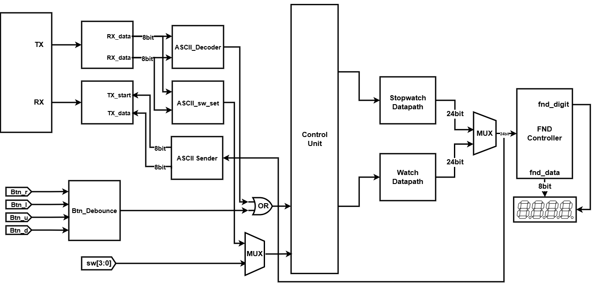

# UART Stopwatch & Watch Controller

> BASYS3(Xilinx Artix-7) FPGA 위에서 UART 통신으로 스톱워치 및 시계를 제어하는 Verilog 설계 프로젝트

---

## 📌 프로젝트 개요

PC의 UART 터미널에서 ASCII 문자를 전송해 FPGA의 스톱워치 / 시계를 실시간으로 제어하고, FPGA가 현재 시각을 다시 PC로 송신하는 **양방향 UART 제어 시스템**입니다.  
기존 물리 버튼/스위치 인터페이스를 UART 인터페이스로 대체 또는 병행 운용할 수 있도록 설계하였습니다.

---

## 🎯 주요 기능

| 기능 | 물리 입력 | UART 입력 |
|---|---|---|
| Run / Stop | `btn_r` | `r` (0x72) |
| Clear | `btn_l` | `l` (0x6C) |
| Up (시간 증가) | `btn_u` | `u` (0x75) |
| Down (시간 감소) | `btn_d` | `d` (0x64) |
| Up / Down 모드 전환 | `sw[0]` | `0` (0x30) — toggle |
| Stopwatch / Watch 전환 | `sw[1]` | `1` (0x31) — toggle |
| Hour:Min / Sec:Msec 표시 전환 | `sw[2]` | `2` (0x32) — toggle |
| Watch 시간 설정 모드 | `sw[3]` | `3` (0x33) — toggle |
| UART 제어 모드 활성화 | `sw[4]` | — |
| 현재 시각 PC 송신 | — | `s` (0x73) |

> `sw[4] = 1` 일 때 UART 입력이 스위치 역할을 대체합니다. `sw[4] = 0` 이면 물리 스위치가 우선합니다.

---

## 🏗️ 시스템 구조

```
//

```

---

## 📁 파일 구성

```
├── uart_top.v          # UART TX / RX / Baud Tick 통합 모듈
├── ascii_decoder.v     # ASCII → 버튼 제어신호 변환 + SW toggle + ASCII Sender
├── control_unit.v      # 스톱워치 제어 FSM (STOP / RUN / CLEAR / SET_WATCH)
├── stopwatch_watch.v   # 최상위 모듈 — 전체 서브모듈 연결
├── fnd_controller.v    # 7-Segment FND 표시 컨트롤러
└── btn_all.v           # 버튼 디바운스 처리
```

---

## 🔧 설계 세부 사항

### UART (9600 baud, 8-N-1)

- **Baud Tick 생성**: 100 MHz 클럭을 `9600 × 16`으로 분주 → 약 6.51 µs 주기의 오버샘플링 tick 생성
- **RX FSM** (`IDLE → START → DATA → STOP`): 수신 시 start bit 감지 후 16배 오버샘플링으로 비트 중앙 샘플링. 데이터를 MSB first로 right-shift하여 수신 버퍼에 적재
- **TX FSM** (`IDLE → START → DATA → STOP`): `tx_start` 펄스로 전송 개시. 내부 버퍼에 데이터를 캡처한 뒤 LSB first로 left-shift 출력

### ASCII Decoder & SW Set

- **`ascii_decoder`**: `rx_done` 펄스 발생 시 수신 데이터를 4비트 원-핫 제어 신호(`ascii_d[3:0]`)로 변환. 매 클럭 기본값 0으로 초기화되어 1클럭 펄스처럼 동작 → 기존 버튼 신호와 OR 연산으로 통합
- **`ascii_sw_set`**: `0`~`3` 문자 수신 시 대응하는 내부 레지스터를 toggle. `sw[4]` 신호로 물리 스위치와 3항 연산자(MUX)로 선택 — OR 대신 MUX를 사용해 두 소스 간 충돌 방지

### Control Unit FSM

4-state Moore FSM (`STOP / RUN / CLEAR / SET_WATCH`)으로 스톱워치 동작 제어

```
STOP ──(run_stop)──▶ RUN ──(run_stop)──▶ STOP
STOP ──(clear)──────▶ CLEAR ──────────▶ STOP
STOP ──(set_watch)──▶ SET_WATCH ──(set_watch=0)──▶ STOP
```

### ASCII Sender

`s` 문자 수신 시 현재 시각(24비트)을 캡처하고, IDLE→SEND→WAIT FSM으로 12회 반복 전송:

```
HH:MM:SS:ms\n  (예: 03:06:00:65)
```
각 숫자는 BCD 분리 후 `bcd_sender`로 ASCII 코드(0x30~0x39)로 변환하여 순차 전송합니다.

---

## 🖥️ 개발 환경

| 항목 | 내용 |
|---|---|
| FPGA 보드 | Digilent BASYS3 (Xilinx Artix-7) |
| 개발 도구 | Vivado 2023.x |
| 시뮬레이터 | Vivado Simulator (XSim) |
| UART 터미널 | ComPortMaster (9600 baud, 8-N-1) |
| 설계 언어 | Verilog HDL |

---

## ✅ 시뮬레이션 검증 항목

- Baud Tick 주기 검증 (6.51 µs @ 100 MHz)
- UART RX / TX 단독 동작 검증 (`r` 문자 수신 → `rx_data = 0x72`)
- Run & Stop 동작 (`r` 입력 → 스톱워치 증가 / 정지)
- Clear 동작 (`l` 입력 → 카운터 초기화)
- Down mode 전환 (`sw[4]=1`, `0` 입력 → 카운트 감소)
- Watch 시간 설정 — min/hour Up & Down (`u` / `d` 입력)
- ASCII Sender 동작 — `HH:MM:SS:ms` 포맷 TX 출력 확인

---

## 🐛 Trouble Shooting

### sw와 UART 신호 OR 결합 문제

**문제**: 물리 스위치와 UART toggle 신호를 OR로 결합하면, 어느 한쪽이 1로 고정된 경우 다른 소스가 동작하지 않는 현상 발생.

**해결**: `sw[4]`를 UART 제어 모드 선택 비트로 지정하고, 3항 연산자(MUX)로 두 소스를 상호 배타적으로 선택하도록 변경.

```verilog
// Before (문제)
assign w_up_down_or = w_ascii_up_down | sw[0];

// After (수정)
assign w_up_down_mux = w_uart_sw_sel ? w_ascii_up_down : sw[0];
```

### 시뮬레이션 시나리오 오류

**문제**: 테스트벤치에서 `sw[4]` 설정 없이 UART 값 전송 시 short 발생 → 제어 신호가 물리 스위치와 동시에 active되는 충돌.

**해결**: 시뮬레이션 시나리오에 `sw[4] = 1` 선행 설정 후 UART 전송하도록 순서 수정.

---

## 📄 License

본 프로젝트는 개인 학습 목적으로 작성되었습니다.
